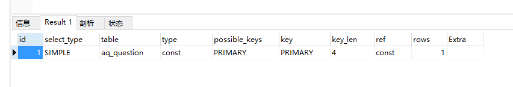

# mysql explain 关键字分析解释

[TOC]

我们需要关注的就两个字段  type 以及rows

## rows：

​	rows越小越好  表示扫描的行数

## type字段解释：

- const  常量级  一般是根据主键id 能直接定位记录行

- ref     比const稍慢  一般根据二级索引查询记录行的时候有可能用到、因为有一次回表的操作 浪费了少许时间   比如 where name='zhangsan'

- ref or null   比ref稍慢  因为又多了一个条件  or null 比如 name='zhangsan' or name = null

- range    范围查询  age>10  and age < 40  

- all  权标扫描  速度最慢

  

  

  

  

  

  

  ## 