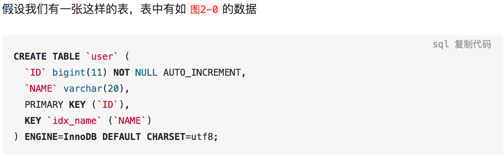
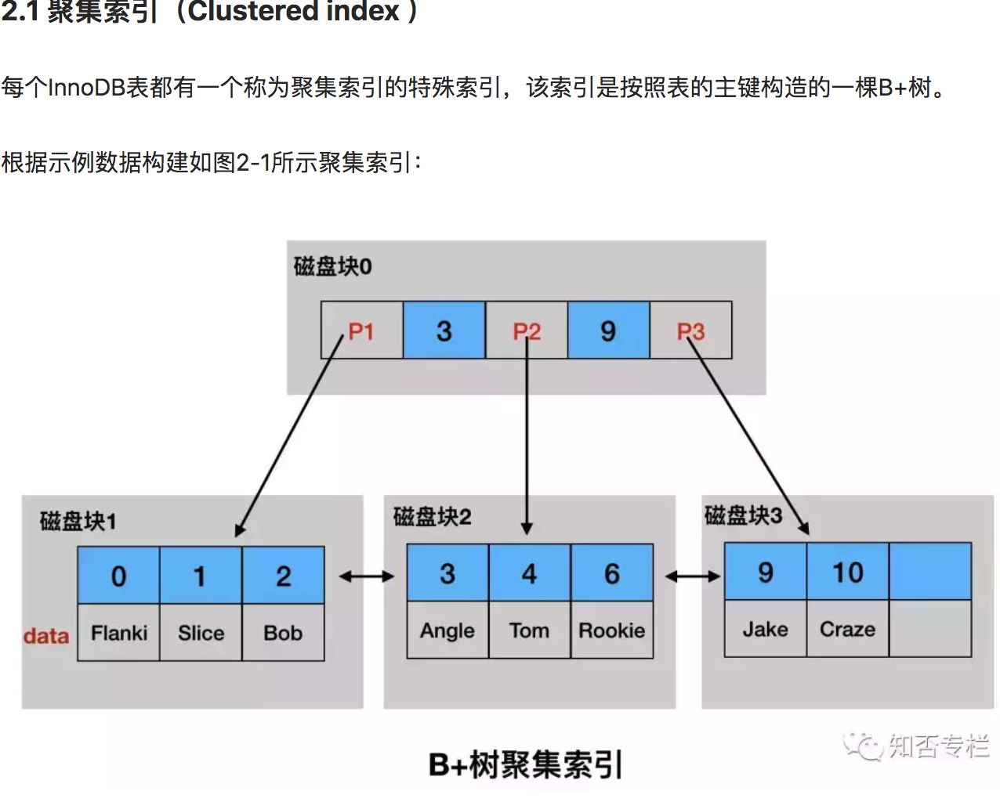
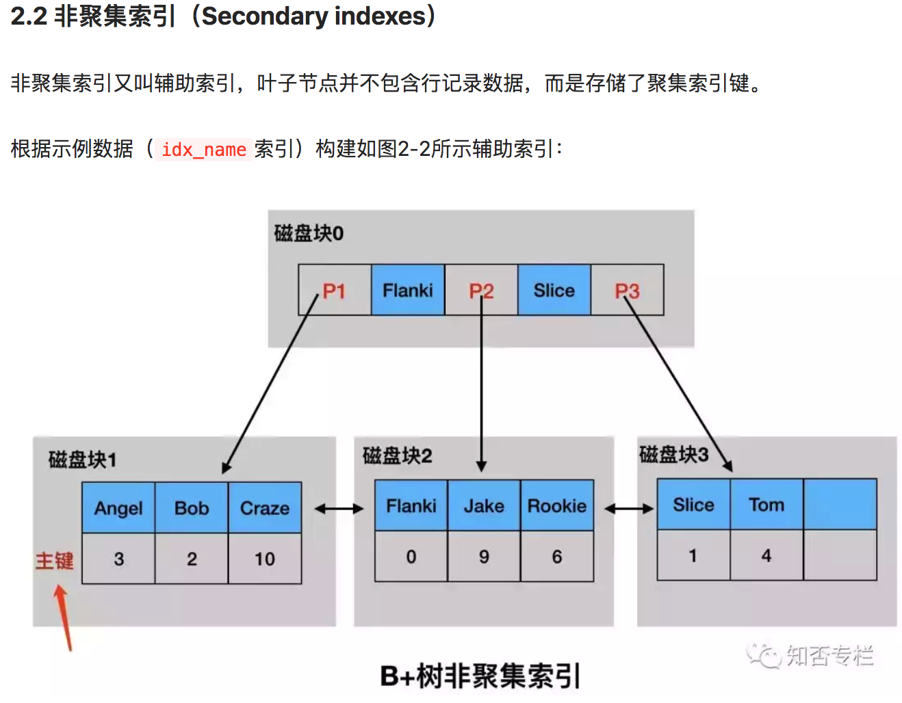

# 索引分类

[TOC]

### 功能上区分

- 主键索引
- 唯一索引
- 普通索引
- 联合索引
- 全文索引

### 存储上区分

- btree

- hash

  

# 索引存储

mysql数据在磁盘是以数据页的方式进行管理；

通俗的讲、 可以讲索引当成一本书的目录  具体的行数据当成存储在书里每页中的数据

### btree

我们有一张这样的表；

#### 聚集索引(一级索引)

聚集索引：根据主键建立的B+树索引： 包含一条数据的全部内容  根据聚集索引不需要在回表查询

#### 非聚集索引(二级索引)

非聚集索引： 除主键以外的字段建立的索引  比如name  ；查询全部字段的时候需要先找到id ，然后在进行回表查询

我们为上面这张表添加一些表数据表数据：

##### 聚集索引的存储结构图

- 叶子节点存放了整张表的所有行数据。

- 非叶子节点并不存储行数据，是为了能存储更多索引键，从而降低B+树的高度，进而减少IO次数。

- 聚集索引的存储在物理上并不是连续的，每个数据页在不同的磁盘块，通过一个双向链表来进行连接

  

例如我们要查找 数据项6：

1. 把根节点由磁盘块0加载到内存，发生一次IO，在内存中用二分查找确定6在3和9之间；

2. 通过指针P2的磁盘地址，将磁盘2加载到内存，发生第二次IO，再在内存中进行二分查找找到6，结束

   

##### 非聚集索引存储结构图:

			

- 每个表可以有多个辅助索引

- 通过辅助索引查数据时，先查找辅助索引获得聚集索引的主键，然后通过主键索引来查找完整的行记录。

- 通过非主键索引比主键索引查找速度要慢一倍

  

例如我们要查找的数据为 name=jake

1. 第一阶段：通过辅助索引查到主键索引的主键
   - 把idx_name索引的根节点由磁盘块0加载到内存，发生一次IO，查找到在P2指针中
   - 根据P2指针的磁盘地址，加载磁盘块2到内存，发生第二次IO，查找到Jake节点以及它的主键索引9
2. 第二阶段：通过主键索引找到完整的行记录
   - 把根节点由磁盘块0加载到内存，发生一次IO，在内存中用二分查找确定9在P3指针中
   - 通过指针P3的磁盘地址，将磁盘3加载到内存，发生第二次IO，再在内存中进行二分查找找到9，以及它的行记录

#####            

​			

### hash

​	通俗的讲   hash就是通过算法计算出数据是实际存储地址的一种方法          

​	

- 优点
  - 速度快  直接寻址
- 缺点
  - 只能适用于 eq 条件
  - 不能大小比较
  - 不能排序
  - 不能范围查询
  - 不能模糊匹配
  - hash函数设计的优劣   直接影响到hash碰撞的概率  影响查询速度
- 适用场景	
  - 一般情况下都不建议使用hash  
  - 用户密码password字段建议可以使用hash   用户密码没有上面的hash缺点所列出来的操作；

